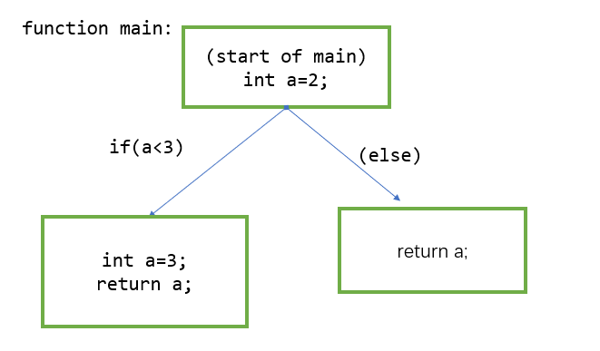

# stage-3实验报告
## 思考题：
由基本块是不包含任何跳转语句。可以将该代码分为
a1:
```c
int a=2;
if (a==3) branch a2
```
a2:
```c
int a=3;
return a;
```
a3:
```c
return a;
```
这几个基本块，再根据条件跳转关系连边即可  
(这里因为是if判断，而不是branch语句，所以为了显示更直观一点将`if(a<3)`判断挪到箭头上了)

## 阶段代码分析
### 前端
在前端代码中，只需要增加parse到AST部分的检查语句，用于生成三地址码的语句无需更改
#### scopestack.py   
由文档中的提示，可以发现我们此时需要把之前单一的作用域改为维护一个作用域栈，每当进入一个block的时候都去压入一个新的作用域，出该block的时候作用域退栈。  
实现上相对简单，只需要实现最基础的stack的操作即可，我们为这个scopestack类增加push,top,pop的方法，以及便于后续对符号表的查找，增加了lookup函数，从栈顶向下遍历各个存在的作用域，寻找元素symbol  
增加以下代码：
```py
class ScopeStack:
    def __init__(self):
        self.stack=[]
    def push(self,scope:Scope):
        self.stack.append(scope)
    def pop(self):
        return self.stack.pop()
    def top(self):
        return self.stack[-1]
    def lookup(self,name:str)->Optional[Symbol]:
        for i in reversed(self.stack):
            if i.containsKey(name):
                return i.get(name)    
        return None

```
#### namer.py
在函数transform里，原先处理作用域的代码是
```py
program.globalScope = GlobalScope
ctx = Scope(program.globalScope)
```
相当于只维护了全局作用域
但是我们现在需要维护一个scopestack,就要先将全局作用域压入scopestack，然后进行accept操作
改上述代码如下：
```py
program.globalScope = GlobalScope
ctx = ScopeStack()
ctx.push(program.globalScope)
program.accept(self,ctx)
```
此时也需要进行一些小的改动，就是把namer里所有如`visitProgram`,`visitReturn`,`visitIntLiteral`的函数改成接收ctx为ScopeStack类型  
接着修改visitBlock，在用for循环处理block的语句之前先压入一个局部作用域，循环结束的时候该作用域出栈。在这一步中踩了一个小坑，就是应该在for循环**外面**压栈，这个原因比较简单，就是for循环针对的是block之中的语句，是Union[Statement,Declaration]类型，所以就在循环外面压栈即可，但是当时写的时候没有注意然后写for循环里面去了，debug了挺久。
接着再改`visitDeclaration`函数，由于局部的变量可以和更外层的变量同名，所以把ctx.lookup改为ctx.top.lookup即可，即是说在当前最小的作用域内没有declare过就加入这个declare

至此，前端操作修改完成

### 后端
根据提示，我们需要修改遍历cfg的方法，只对可以到达的block进行遍历，所以我们增加如下代码
```py
#go to the head
        head=0
        for (u,v) in edges:
            if self.getInDegree(u)==0:
                head=u
                break
        self.reachable_nodes.add(self.getBlock(head))
        #queue to help bfs
        que = []
        que.append(head)
        while que.__len__():
            cur=que.pop(0)
            for i in self.links[cur][1]:
                if self.getBlock(i) not in self.reachable_nodes:
                    self.reachable_nodes.add(self.getBlock(i))
                    que.append(i)

```
我们定义reachable_nodes是一个set,所有可以到达的块的集合，我们先去到第一个块（通过对边的遍历找到第一个有后继无前驱的块），然后用队列实现简单的bfs，对每一个遍历到的块塞到reachable_nodes中，然后修改iterator函数如下
```py
        list_iter=[]
        for i in self.nodes:
            if self.reachable_nodes.__contains__(i):
                list_iter.append(i)
        return iter(list_iter)

```
没错，这里之前也踩了坑，因为不能按reachable_nodes的顺序遍历，因为set一般不讲求插入的顺序和排列顺序一致，所以我们按照原先nodes的次序遍历，如果在reachable_nodes中就访问，就可以保证正确的bfs遍历顺序  